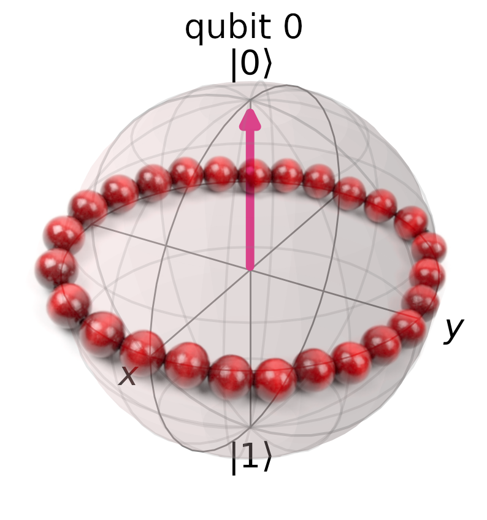

# quantum_maps_for_beads
Quantum maps for beads is a simple toy model for quantum feature map optimization.

The idea behind this project to explore the capabilities of quantum feature maps, kernnel and optimization procedures for target kernel alignment.

## The Problem formulation

1. We create N regularly spaced points (beads) on the [0,1] interval.
- Their labels are alternating between +1 and -1.

- To simplify the problem we assume that N is even.

2. We "thread the beads":
- The feature map is created. The feature map takes the beads locations and maps them on one qubit.
    The feature map consists of Hadamard layer, followed by a parameterized Z-rotation, followed by Hadamard layer.

    First Hadamard layer, moves the initial state |0> to a |+> state, which resides on the bloch sphere equator.

    The parameterized Z-rotation moves the beads around the equator. The rotation angle is defined as: (location of the bead)*(phi), where phi is the customizable parameter.

    Second Hadamard layer transformes the states into the computational basis.

- The ideal feature map will send all the +1 class beads to one (ex. |0>) pole of the bloch sphere and all the -1 class beads to the other pole.

    In the ideal feature map each positive class bead is rotated to |+> (|->) state, while the negative class beads are rotated to |-> (|+>) states.
    
    To achieve that the ideal map parameter value would be phi_ideal = (N-1)*np.pi (and its odd multiplicities).

3. We optimize the map parameter with respect to target kernel alignment and see whether we obtain the ideal feature map.

## Files

[An introduction to the problem](toy_model_formulation.ipynb)

[Optimization procedure](toy_model_optimization.ipynb)